<!-- HERO ANIMATION LINKED FROM REPO -->

  

<!-- ELEGANT NATIVE NAMEPLATE -->
<h1 style="color: #FCD34D; font-family: 'Cinzel', 'Times New Roman', serif; font-size: 3.5em; letter-spacing: 2px; font-weight: normal; margin-bottom: 5px;">
  Sourav Mondal
</h1>

 

   

<!-- SECTION: THE INSTRUMENTS -->
<h2 style="color: #E8590C; font-family: 'Cinzel', 'Times New Roman', serif; letter-spacing: 6px; font-weight: normal;">✦ THE INSTRUMENTS ✦</h2>

every principle is executed through these

   

<!-- SECTION: THE GENERATIVE NEBULA -->
<h2 style="color: #A01414; font-family: 'Cinzel', 'Times New Roman', serif; letter-spacing: 6px; font-weight: normal;">✦ THE GENERATIVE NEBULA ✦</h2>
 

 

   

<!-- SECTION: THE CONSTELLATIONS -->
<h2 style="color: #D4A054; font-family: 'Cinzel', 'Times New Roman', serif; letter-spacing: 6px; font-weight: normal;">✦ THE CONSTELLATIONS ✦</h2>
 

 

   

<!-- FINALE: ASTROLABE ANIMATION LINKED FROM REPO -->

